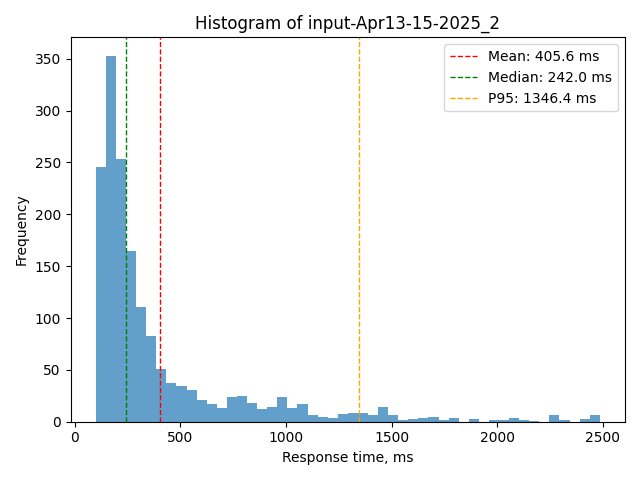

## Summary of Statistical Findings:
- **P-value** = 0.000 (alpha = 0.05)
- **Result**: A statistically significant difference was detected.
- The P95 (1342.4) exceeds the threshold (1000). ⚠️
- Margin of Error for Sample 1: ±9.2%

## Recommendations:
- Proceed with decision-making based on the observed difference.
## Visual Analysis

